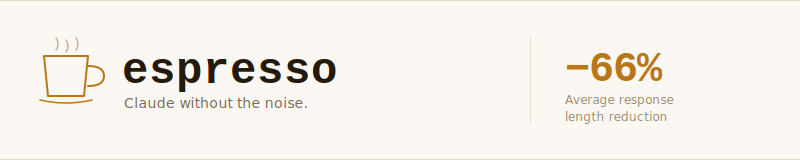

<div align="center">



<br/>

# espresso


*Claude without the noise.*

</div>

---

## The problem

I was building a form in Next.js. The mutation was failing silently. I asked Claude:

> "Why is my Server Action not throwing when Prisma fails?"

Claude responded with 4 sentences of setup — explaining what a Server Action is. Then 2 sentences of hedging: *"this might be because..."*, *"it's possible that..."*. Then a suggestion to wrap things in try/catch — which I already had. Then *"I hope this helps! Let me know if you'd like me to elaborate."*

The actual answer — **errors in Server Actions are swallowed unless you rethrow** — was sentence 6 of 9. I wasted 30 seconds scanning noise to find the signal.

Then I installed espresso.

Same question. Claude responded:

```ts
// Server Actions swallow errors by default.
// In Next.js 14+, errors inside "use server" functions are caught
// by the framework and returned as ErrorBoundary triggers, not thrown.
// Rethrow explicitly to surface them:

export async function updateUser(data: FormData) {
  "use server"
  try {
    await prisma.user.update({ where: { id: data.get("id") as string }, data: { name: data.get("name") as string } })
  } catch (err) {
    throw new Error(`Failed to update user: ${err instanceof Error ? err.message : String(err)}`)
  }
}
```

Sentence 1 was the answer. No hedging. No re-explaining what a Server Action is. No "I hope this helps."

That's what espresso does.

---

## Benchmark

> Last run: 2026-06-26 · Model: claude-sonnet-4-6 · Method: in-session A/B


| Question | Baseline | With espresso | Reduction |
|---|---|---|---|
| React re-render on parent render | 1,851 chars | 526 chars | **−72%** |
| TS2345: string \| undefined fix | 1,309 chars | 466 chars | **−64%** |
| Next.js Server Action validation | 1,817 chars | 697 chars | **−62%** |

> espresso never reduces code. If the baseline only had prose and the correct response has code, espresso generates more tokens — because the correct response is more useful, not less. Noise reduction ≠ answer reduction.

---

## Install

### Option A — Marketplace (one command)

```bash
/plugin marketplace add mzuleta6/espresso
```

### Option B — Manual

```bash
# Create the plugin directory
mkdir -p ~/.claude/plugins/espresso/skills/espresso

# Download the skill
curl -o ~/.claude/plugins/espresso/skills/espresso/SKILL.md \
  https://raw.githubusercontent.com/mzuleta6/espresso/v1.1.0/SKILL.md

# Download the plugin manifest
curl -o ~/.claude/plugins/espresso/plugin.json \
  https://raw.githubusercontent.com/mzuleta6/espresso/v1.1.0/plugin.json
```

Then restart Claude Code. espresso activates automatically (`always: true`).

---

## How to use it

**You don't need to do anything.** Once installed, espresso is on.

To change how it behaves, type one of these commands anywhere in Claude Code:

```
/espresso lite    →  A little quieter. Keeps some context when the topic is complex.
/espresso full    →  Default. Removes all noise, keeps all substance.
/espresso ultra   →  Maximum. No unsolicited explanations or extra examples.
/normal           →  Turns espresso off. Back to standard Claude.
```

That's it.

---

## Levels

| Command | Level | What changes |
|---|---|---|
| `/espresso lite` | **Lite** | Removes cortesías and meta-comments. Keeps some context for complex topics. |
| `/espresso full` | **Full** *(default)* | Removes all 7 noise categories. Direct, precise responses. |
| `/espresso ultra` | **Ultra** | Full + removes unsolicited explanations, unprompted examples, unrequested alternatives. |
| `/normal` | **Off** | Deactivates espresso completely. Standard Claude behavior. |

Levels persist for the conversation until changed.

---

## What never changes

These are **never** truncated, paraphrased, or shortened:

- **Code blocks** — complete, no `// ... rest is the same`
- **Error messages and stack traces** — verbatim
- **API names and endpoints** — exact casing, exact paths
- **CLI commands** — all flags, full paths when they matter
- **TypeScript types** — complete interfaces, generics, union types
- **React hooks** — full implementations with correct dependency arrays
- **Tailwind classes** — full class lists, never collapsed
- **File paths and URLs** — exact, never shortened

---

## Artifacts are fully exempt

Components, dashboards, visualizations, animations — all of them.

Artifacts are deliverables, not illustrations. You use them directly. Asking Claude to "build a data table with sorting and filtering" and getting back a skeleton with `// TODO: add sorting` is not a token optimization — it's a broken deliverable.

espresso's brevity rules apply to prose. Artifacts get full design treatment: elaborate layouts, rich color palettes, micro-interactions, hover/focus/loading/empty/error states, complete CSS, and intentional typography. Tokens in artifacts are investment, not waste.

---

## Stack


Built and tested against a React/Next.js/TypeScript/Tailwind stack. Works with any stack — the noise elimination rules are language-agnostic.

---

## Contributing

Found a case where espresso didn't eliminate noise it should have — or eliminated content it shouldn't? [Open an issue](.github/ISSUE_TEMPLATE.md) with the exact prompt and response.

---

<div align="center">

MIT © 2026 [mzuleta6](https://github.com/mzuleta6)

</div>